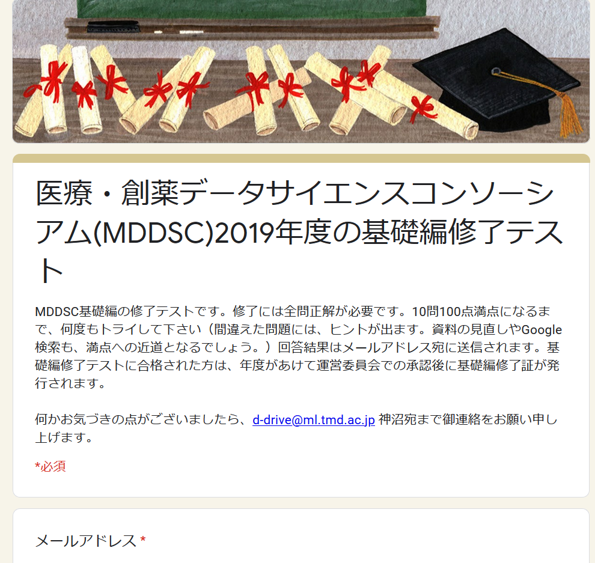
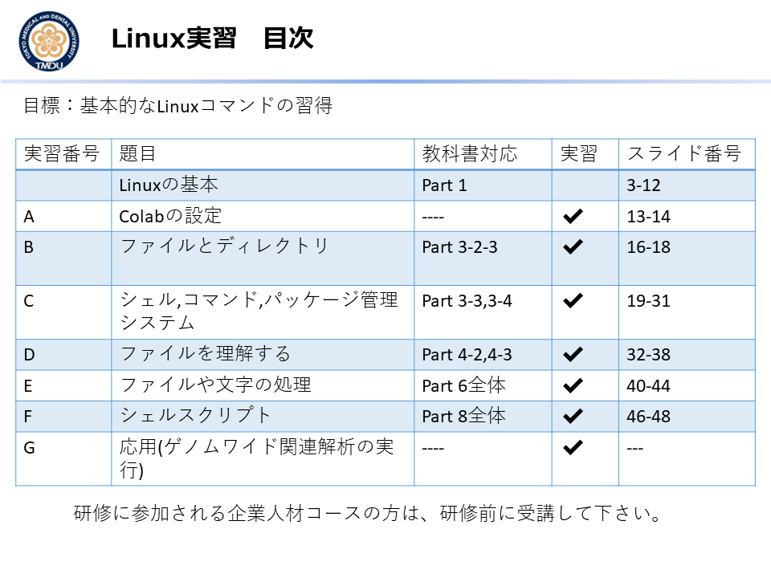
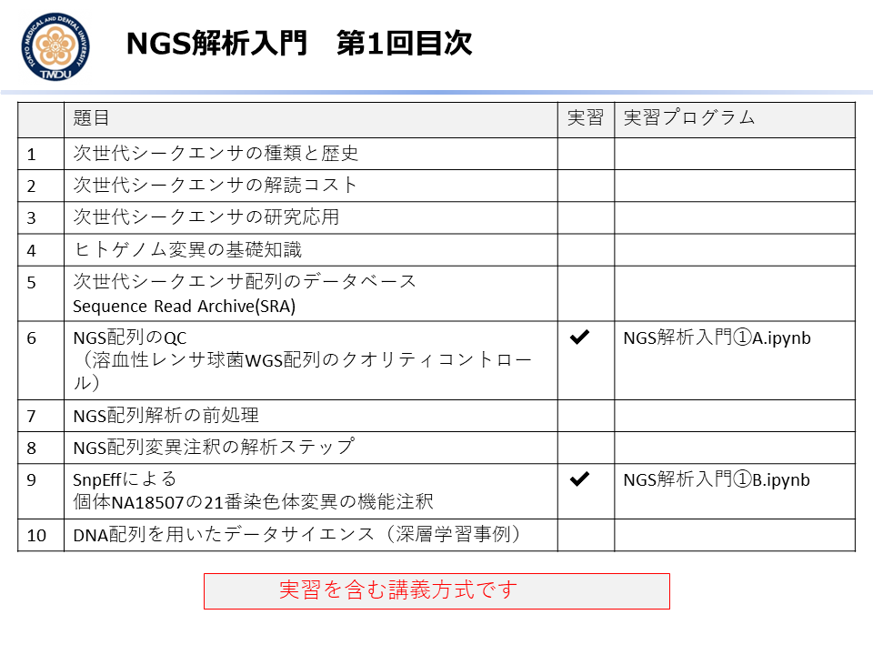
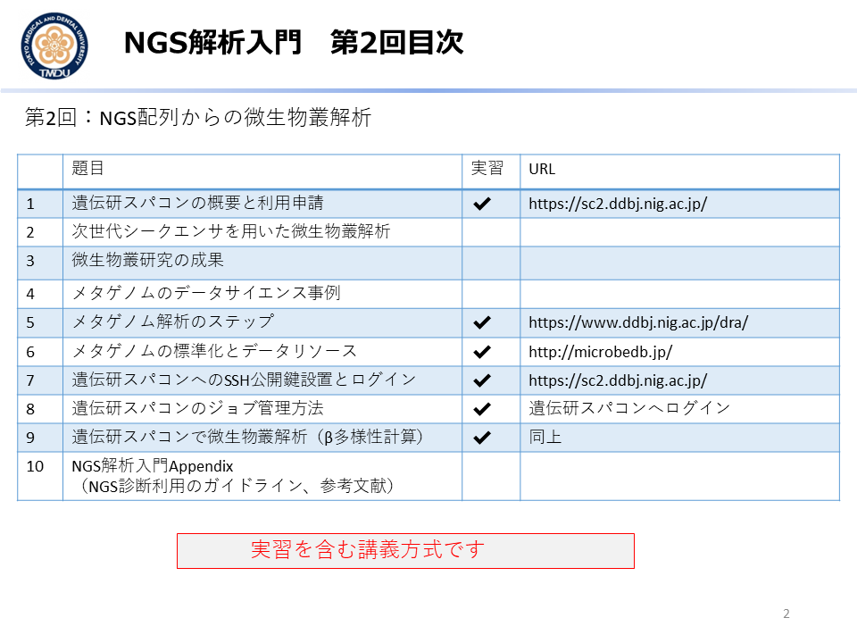
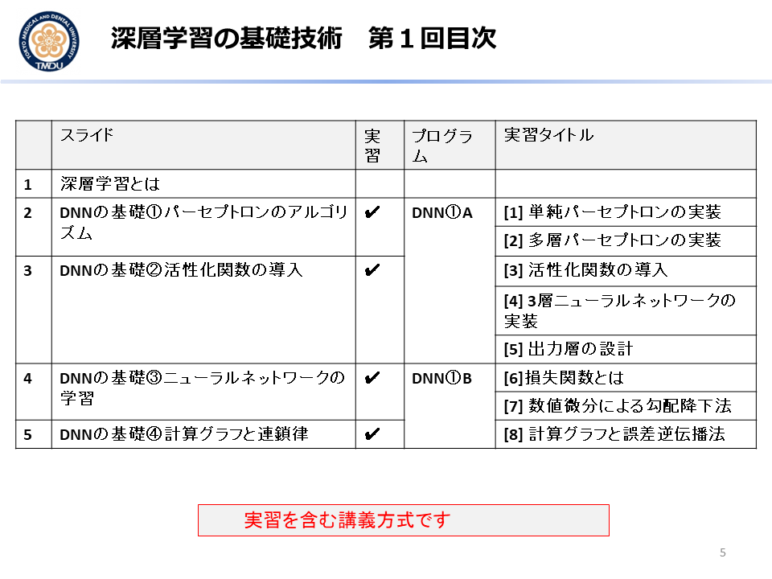
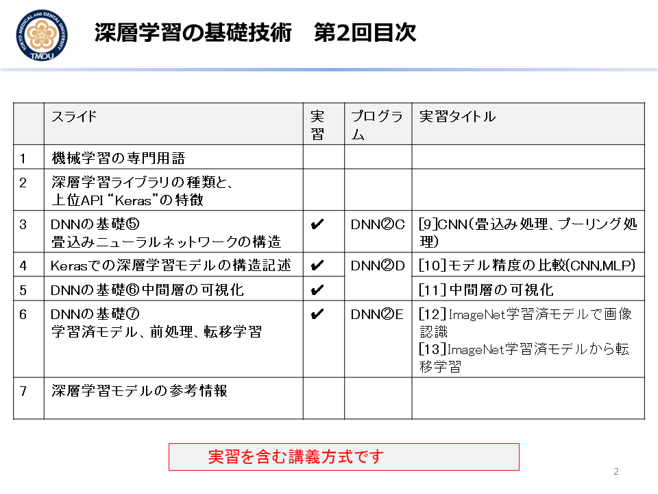
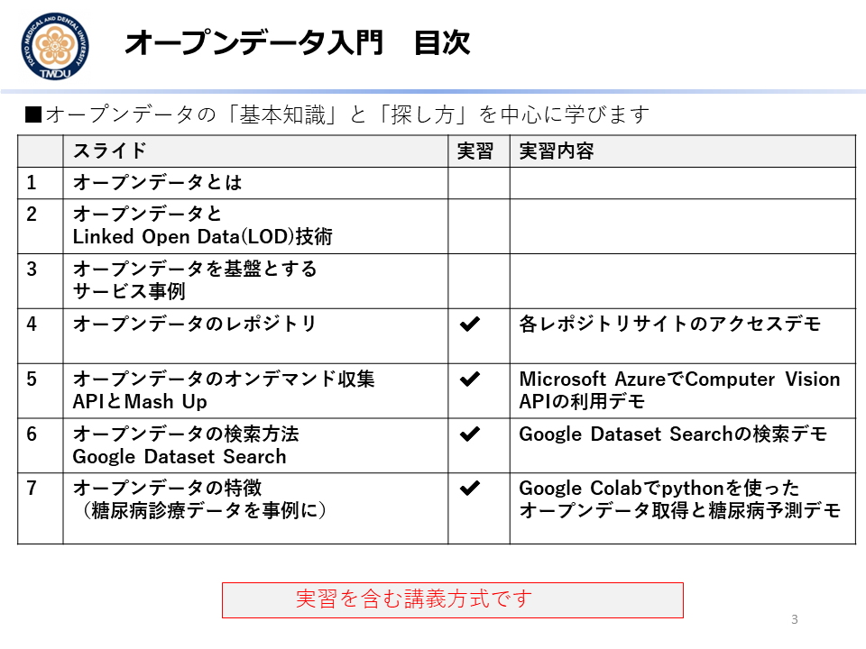
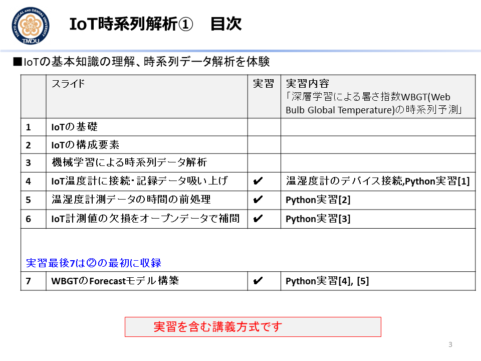
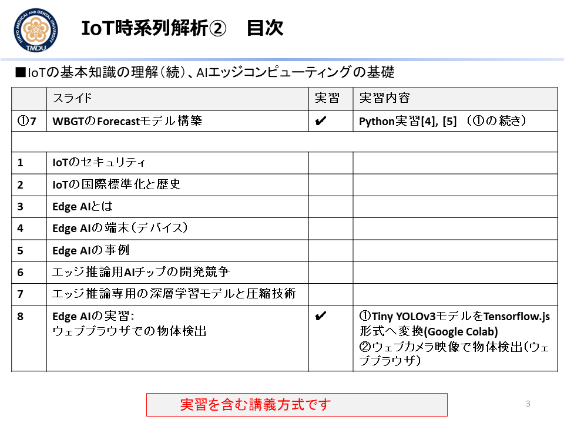

## MDDSC([医療・創薬データサイエンスコンソーシアム](http://md-dsc.com/))の2019年度教材
e-Learningシステム掲載のビデオ映像, MS Powerpointスライド, Google Colabのプログラム実習教材、を提供しています。
2019.4.1から2年間有効です。

- **[1] Linux実習** [[目次](#LINUX)]
- **[2] NGS解析入門　第1回**  [[目次](#NGS2)]
- **[3] NGS解析入門　第2回**  [[目次](#NGS2)]
- **[4] 深層学習の基礎技術　第1回** [[目次](#DNN1)]
- **[5] 深層学習の基礎技術　第2回** [[目次](#DNN2)]
- **[4] オープンデータ入門** [[目次](#OPD),  [Google Colab](diabetes_opendata.ipynb)]
- **[5] IoT時系列解析　第1回** [[目次](#IoT1)]
- **[6] IoT時系列解析　第2回** [[目次](#IoT2)]
- **[7] 2019年度 Amazon Web Service機械学習PBLセミナー アイデアソン　2019.11.7** [[開催報告](http://md-dsc.com/events/20191128event.php)、[スライド当日手順](EK_AWSPBL191128.pdf)]
- **[8] 第2回MDDSC機械学習コンペティション2020.1.20** [[開催報告](http://md-dsc.com/events/20200120event.php)、 [スライド審査手続き](EK_MLCOMP200120.pdf)]
- **[9] 実習支援　[Blockchain入門の実習補足資料](https://github.com/ekaminuma/BCLOG191213) 2019.12.13**
- **[10] 基礎編修了テスト**

---
## 基礎編修了テスト

- MDDSCの基礎編の修了には、オンラインテストで満点を取る必要があります。
- Google Formのテスト機能を使って、オンラインでテストを実施できる様に構築しました。
- オンラインテストの条件設定
   + 何度でも投稿可能
   + テスト投稿時に、結果が登録したe-mail addressに送信される。
   + テスト結果である点数表示と共に「間違えた問題のヒント」が提示される。忠実に実行すれば、正解に辿り着ける程度のヒントを作成した。
   
  <kbd></kbd>
   

----
----
##目次一覧

## LINUX
Linuxの基本コマンドを、Google Colabクラウド環境で実習する。本実習では、ファイル操作やシェルスクリプトの実行方法を学ぶ。またゲノムワイド関連解析用（遺伝子型・表現型）データをクラウド環境へダウンロードして、コマンド操作を行う。 

<kbd></kbd>
 
## NGS1
次世代シーケンサー（Next Generation Sequencer：NGS）配列解析の基礎を学ぶ。NGS装置の種類と特徴、配列の品質管理、Sequence Read Archive、ゲノム配列変異注釈、微生物叢解析を扱う。実習ではGoogle Colabに専用ソフトをダウンロードしNGS配列を解析する。

<kbd></kbd>
 
## NGS2
<kbd></kbd>
 
## DNN1
深層ニューラルネットワークの基礎技術をプログラミング実習で学ぶ。ネットワーク構造、活性化関数、学習方法の種類、損失関数、最適化、誤差逆伝播法、前処理、畳み込み処理、プーリング処理、重み可視化、学習データセットと学習済モデル、GPU等を学ぶ。

<kbd></kbd>
 
## DNN2
<kbd></kbd>
 
## OPD
本実習では、学習用データ素材としてのオープンデータの利用方法と課題を学ぶ。公共サイトやGoogle Dataset Searchからのデータ収集、オープンデータの特徴を理解する。事例として電子カルテ（糖尿病）のオープンデータを解析する。

<kbd></kbd>
 
## IoT1
IoT機器の通信規格・セキュリティを概説する。初回実習は本学M&Dタワー外に設置の温湿度センサーから時系列データを取得（常時可、予約不要）、地理位置情報（地上IoT、 衛星IoT)と合わせて解析する。二回目の実習では、AIエッジ端末（予約貸出）を動かし、遅延等課題を体験する。 

 <kbd></kbd>
 
## IoT2
<kbd></kbd>
